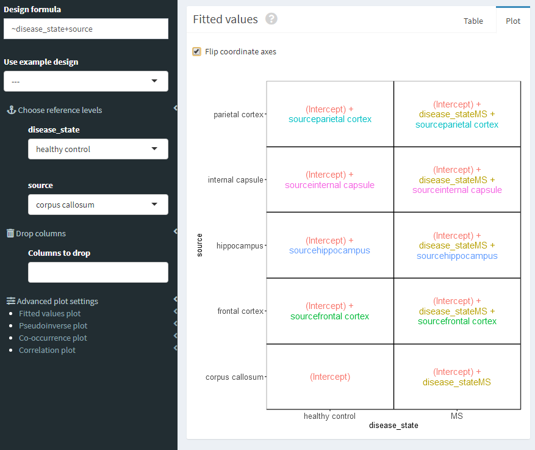

## Título de set de datos a utilizar: Single-nucleus RNA sequencing of human cortex affected by multiple sclerosis

***

### Obtención de datos y modificaciones iniciales

```{r, message = FALSE}
library("recount3")

## Obtaining projects
human_projects <- available_projects()

## Title:
## Single-nucleus RNA sequencing of human cortex affected by multiple sclerosis


## Creating RSE object with specific info
rse_gene_SRP173190	 <- create_rse(
  subset(
    human_projects,
    project == "SRP173190" & project_type == "data_sources"
  )
)


## Extracting read counts
assay(rse_gene_SRP173190, "counts") <- compute_read_counts(rse_gene_SRP173190)

## Making info easier to handle
rse_gene_SRP173190 <- expand_sra_attributes(rse_gene_SRP173190)

```

***

### Exploración y filtrado de datos

```{r, message = FALSE}

## Exploring interest columns

colData(rse_gene_SRP173190)[
  ,
  grepl("^sra_attribute", colnames(colData(rse_gene_SRP173190)))
]

## Saving SE object just in case
rse_gene_SRP173190_unfiltered <- rse_gene_SRP173190

```
Se observa que solamente hay 3 columnas con atributos de interés, a las cuales no hay que realizarles ningún cambio ya que tienen el tipo de dato correcto

```{r, message = FALSE}
## Exploring differences between groups
barplot(table(rse_gene_SRP173190$sra_attribute.disease_state), main = "Groups")
table(rse_gene_SRP173190$sra_attribute.disease_state)

```
En la gráfica de barras se observa que en ambos grupos hay el mismo número de muestras, por lo que no habrá ningún sesgo relacionado a alguna dferencia en el número de muestras. Esto se confirma justamente con la tabla mostrada.

```{r, message = FALSE}
## Exploring expression means
summary(rowMeans(assay(rse_gene_SRP173190, "counts")))
```
Se ve que el primer cuartil es de muy baja expresión, por lo que convendría filtrar esos genes de baja expresión.
```{r, message = FALSE}
## Filtering of low expression genes
expr_means <- rowMeans(assay(rse_gene_SRP173190, "counts"))
rse_gene_SRP173190 <- rse_gene_SRP173190[expr_means > 0.1, ]
```

Un posible problema que podría haber es que el porcentaje de secuencias asignadas a un gen sea demasiado bajo, por lo cual se requiere observar cuáles son las tendencias
```{r, message = FALSE}
## Exploring assign percentage
hist(rse_gene_SRP173190$`recount_qc.gene_fc.all_%`, xlab = "% de asignacion", main = "")
## No filtering because assignment percentage is quite good
```
En el histograma del porcentaje de asignación se ve que el porcentaje es generalmente bueno, el porcentaje de asignación más pequeño es 50%, por lo que realmente no conviene filtrar esos datos.
```{r, message = FALSE}
## How much did we keep
round(nrow(rse_gene_SRP173190) / nrow(rse_gene_SRP173190_unfiltered) * 100, 2)
```
Después de filtrar los genes de baja expresión, nos quedamos con el 75% de los genes que había originalmente

***

### Normalización de datos

```{r, message = FALSE}
library("edgeR")
dge <- DGEList(
  counts = assay(rse_gene_SRP173190, "counts"),
  genes = rowData(rse_gene_SRP173190)
)
dge <- calcNormFactors(dge)

```

***

### Exploración de modelo estadístico propuesto

Se propone un modelo en el que se va a comparar la expresión de genes en varios tejidos de cerebro de pacientes sanos y pacientes con esclerosis múltiple. El modelo propuesto se formularía como $$~grupoDeEnfermedad+tejido$$ Se debe verificar que este modelo sea full rank, es decir, que las variables a utilizar sean linealmente independientes.

```{r, message = FALSE}
## Exploring our proposed statistic model

library("ExploreModelMatrix")

data <- data.frame(disease_state = colData(rse_gene_SRP173190)$sra_attribute.disease_state,
                   source = colData(rse_gene_SRP173190)$sra_attribute.source_name)
vd <- ExploreModelMatrix::VisualizeDesign(
  sampleData = data,
  designFormula = ~ disease_state + source,
  textSizeFitted = 2
)

cowplot::plot_grid(plotlist = vd$plotlist)


## Proposed model (~disease_state + source) is full rank, checked with ExploreModelMatrix()

## Assigning our already defined model to variable

mod <- model.matrix(~ sra_attribute.disease_state + sra_attribute.source_name,
                    data = colData(rse_gene_SRP173190)
)
```
Con ayuda de la funcion ``ExploreModelMatrix()`` se verificó que efectivamente era full rank y se rotó para facilitar su visualización:




***

### Explorando un posible sesgo de asignación de secuencias en los dos grupos a considerar

En este punto, se pensó que un posible sesgo que podría ocurrir es que debido a que no se filtraron los datos de las secuencias por su porcentaje de asignación, hubiera más secuencias no asignadas en un grupo que en otro, por lo que se visualizó esto con ayuda de una gráfica.

```{r, message = FALSE}
library("ggplot2")
library("ggsignif")

## Checking if differences are significant in total % of assignment
df <- data.frame(disease_state = rse_gene_SRP173190$sra_attribute.disease_state, 
                 gene_assign =
                   rse_gene_SRP173190$`recount_qc.gene_fc.all_%`)

ggplot(df, aes(x = disease_state, y = gene_assign)) +
  geom_boxplot() +
  theme_bw(base_size = 20) +
  ylab("Assignment %") +
  xlab("Disease state") +
  geom_signif(comparisons=list(c("MS", "healthy control")),map_signif_level=TRUE)
```
A primera vista podría parecer que sí hay una diferencia, pero al usar la librería ``ggsignif`` que calcula el p-value, se comprueba que estas diferencias no son significativas.

*** 

### Análisis DE

```{r, message = FALSE}
library("limma")
vGene <- voom(dge, mod, plot = FALSE)
```

```{r, message=FALSE}
## Creates linear regression model and calculates p-values
eb_results <- eBayes(lmFit(vGene))


## Summary of expression results
de_results <- topTable(
  eb_results,
  coef = 2,
  number = nrow(rse_gene_SRP173190),
  sort.by = "none"
)
```
A partir del objeto que se crea con ``topTable()``, se pueden filtrar los genes cuya expresión sí es estadísticamente diferente en ambos grupos.
```{r, message=FALSE}
## how many genes are actually expressing differentially
table(de_results$adj.P.Val < 0.05)
```
Se observa que 5376 genes de los que se tenían son los que tienen un p-value que indican que sí se expresan significativamente diferente

```{r, message=FALSE}
## Visualizing expression differences in both groups
plotMA(eb_results, coef = 2)
```
En la gráfica anterior, se muestran las diferencias de expresión en grupos sanos y con esclerosis múltiple, valores positivos en el eje de las Y indican que hay mayor expresión de un gen en el grupo sano, mientras que valores negativos en el eje Y, indican mayor expresión en el grupo con esclerosis múltiple. En el eje X, el promedio de expresión de los genes. Básicamente la gráfica muestra que, a simple vista, hay un poco mas de genes expresados en el grupo sano que en el grupo con esclerosis múltiple, ya que ahí es donde hay más valores extremos (alejados del cero).

```{r, message=FALSE}
## Highlighting 5 genes with lower p-values
volcanoplot(eb_results, coef = 2, highlight = 5, names = de_results$gene_name)
```
En la gráfica de volcán, valores más alejados del cero en el eje Y indican menor p-value y, por lo tanto, mayor significancia estadística. En esta gráfica en específico, se muestran los 5 genes con p-value más pequeño. En el eje X simplemente el log fold change de los valores de expresión de cada gen.

```{r, message = FALSE}

##Extracting most important genes
exprs_heatmap <- vGene$E[rank(de_results$adj.P.Val) <= 50, ]

## creating data.frame 
df <- as.data.frame(colData(rse_gene_SRP173190)[, c("sra_attribute.disease_state",
                                                    "sra_attribute.source_name")])
colnames(df) <- c("DiseaseState", "Tissue")
our_match <- which(rowRanges(rse_gene_SRP173190)$gene_id %in% rownames(exprs_heatmap))
rownames(exprs_heatmap) <- rowRanges(rse_gene_SRP173190)$gene_name[our_match ]

## Creating pheatmap
library("pheatmap")
pheatmap(
  exprs_heatmap,
  cluster_rows = TRUE,
  cluster_cols = TRUE,
  show_rownames = TRUE,
  show_colnames = FALSE,
  annotation_col = df
)

```
En el pheatmap anterior se pueden observar los 50 genes con expresión significativamente diferente. Se observa, por ejemplo, que BAG3, SERPINA3 y RP11 son los genes más expresados tanto en pacientes sanos como en pacientes con esclerosis, aunque en los 3 casos, la expresión es mayor en pacientes con esclerosis (concordante con https://nn.neurology.org/content/8/2/e941 ). Y también, dos genes que resaltan a la vista, son IGHG1 y IGKC, ya que se observa que la expresión en pacientes con esclerosis múltiple es bastante mayor que en pacientes sanos.  
Ahora, para observar mejor si sí hay una diferencia de expresiones en nuestros dos grupos, se hace un Mulltidimensional Scaling.
```{r, message=FALSE}
library("RColorBrewer")
df <- as.data.frame(colData(rse_gene_SRP173190)[, c("sra_attribute.disease_state", "sra_attribute.source_name")])
## Disease state MDS
plotMDS(vGene$E, labels = df$sra_attribute.disease_state, col = rep(c("red", "blue"), each = 25))
```
En la gráfica anterior se puede observar como hay una separación de ambos grupos, dicha separación es un poco difusa en el centro, donde hay algunos puntos sobrelapantes. Esto indica que si se buscan genes expresados diferencialmente entre pacientes con sanos y pacientes con esclerosis múltiple, es probable que algunos lo sean.

```{r, message=FALSE}
## Tissue MDS

col.tissue <- df$sra_attribute.source_name

col.tissue[col.tissue==unique(df$sra_attribute.source_name)] <- c("blue", "red", 
                                                                  "purple", 
                                                                  "orange", "black")

col.tissue[45:49] <- c("blue", "red", "purple", "orange", "black")

plotMDS(vGene$E, labels = df$sra_attribute.source_name, col = col.tissue)
```

En la gráfica anterior se muestra que los tejidos no forman ningún tipo de clúster específico. Es probable que al relacionar los tejidos con alguna otra variable desconocida se formen cúmulos que expliquen la forma de la distribución de los tejidos y por lo tanto, haya relación entre más variables desconocidas.
